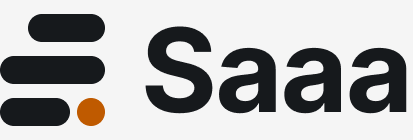

<p align="center">
  <picture>
    <source media="(prefers-color-scheme: dark)" srcset=".github/assets/lockup-dark.png">
    
  </picture>
</p>

<p align="center"><b>Every call, in context.</b></p>

Saaa is a native macOS utility that turns your calls into durable project knowledge. Press one hotkey during a call. Saaa records both sides, transcribes on your Mac, works out which of your local projects the conversation belongs to, and writes the decisions, preferences, and action items back into that repository. You approve every write.

Nothing leaves your machine. Audio is captured with Core Audio process taps, transcribed locally with Whisper, and deleted the moment its transcript exists. Transcripts are encrypted at rest. The only network traffic is your own Claude Code subscription doing the reasoning, plus a one-time model download.

## How it works

1. Press the global hotkey while you are in a call. Saaa finds the conferencing app and records your microphone and the remote side as two separate, sample-aligned streams.
2. When the call ends, both streams are transcribed locally with Whisper and merged into a single Me and Them transcript. The calendar event you were in seeds the vocabulary so names and project terms come out right.
3. A local prefilter shortlists the projects your Claude Code already knows. Claude Code then reads the shortlist and the transcript and returns a match with a confidence score, the call type, and the context worth keeping.
4. A review window shows the transcript, the match, and each extracted item. You untick what you do not want. One click writes decision logs, client preferences, specs, and action items into the matched repository. Writes are additive and refuse to touch files that changed since review.
5. The sealed session lands in History. Raw audio is already gone.

## The island

Saaa lives in the MacBook notch. A dark island grows out of the hardware while you record, shows live Me and Them meters, and retreats when it has filed the call. Macs without a notch get a floating capsule. The menu bar remains the keyboard-accessible route.

## Privacy posture

- Recording, transcription, matching, and storage all happen on this Mac.
- Audio is deleted after transcription by default. Transcripts, matches, and judgments are sealed with AES-GCM using a key in your Keychain.
- A visible indicator is always shown while recording. Consent laws vary by place; telling people you record is your responsibility.
- Logs contain state transitions and error codes, never call content.
- No repository is ever written without an explicit confirmation, and low-confidence matches are presented as unfiled rather than guessed.

## Requirements

- Apple Silicon Mac with macOS 15 or newer.
- Xcode 16.4 or newer to build.
- [Claude Code](https://claude.com/claude-code) installed and signed in, for project matching and extraction. Saaa works without it; calls simply stay unfiled.
- About 2 GB of disk for the Whisper model, downloaded once on first run.

## Build and run

```sh
git clone https://github.com/collinsadi/Saaa.git
cd Saaa
xcodebuild -project Saaa.xcodeproj -scheme Saaa -configuration Debug build
```

Copy the built app to Applications and launch it from there. First run walks you through permissions (microphone, system audio, calendar), the model download, and the Claude Code check. The system audio grant is added manually in System Settings under Privacy and Security, in the System Audio Recording Only list; onboarding guides and verifies the step.

Tests live in each local package:

```sh
for p in Packages/*/; do (cd "$p" && swift test); done
```

## Project layout

Ten local Swift packages behind one app target: AudioCapture, CallSession, Transcription, CalendarContext, Matching, ClaudeBridge, Extraction, Persistence, DesignSystem, and Core. Swift 6 with strict concurrency throughout. The UI binds to design tokens generated from the Figma foundations; the audio hot path is lock-free and allocation-free.

## Contributing

See [CONTRIBUTING.md](CONTRIBUTING.md). AI agents contributing code must follow [AI_POLICY.md](AI_POLICY.md). Security reports go through [SECURITY.md](SECURITY.md).

## Third party

Saaa vendors the [whisper.cpp](https://github.com/ggml-org/whisper.cpp) XCFramework (MIT License) and downloads Whisper and Silero VAD model weights at first run.

## License

[Apache License 2.0](LICENSE). Copyright 2026 Collins Adi.
